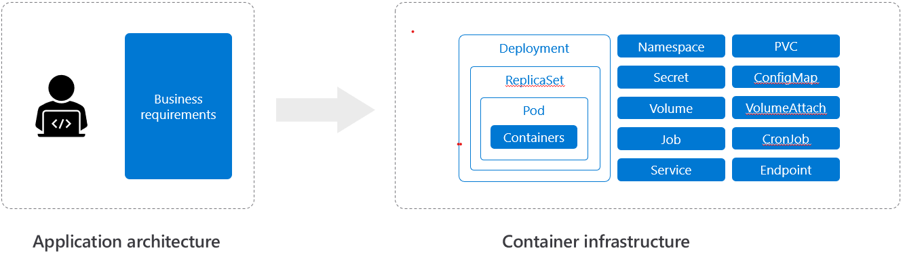
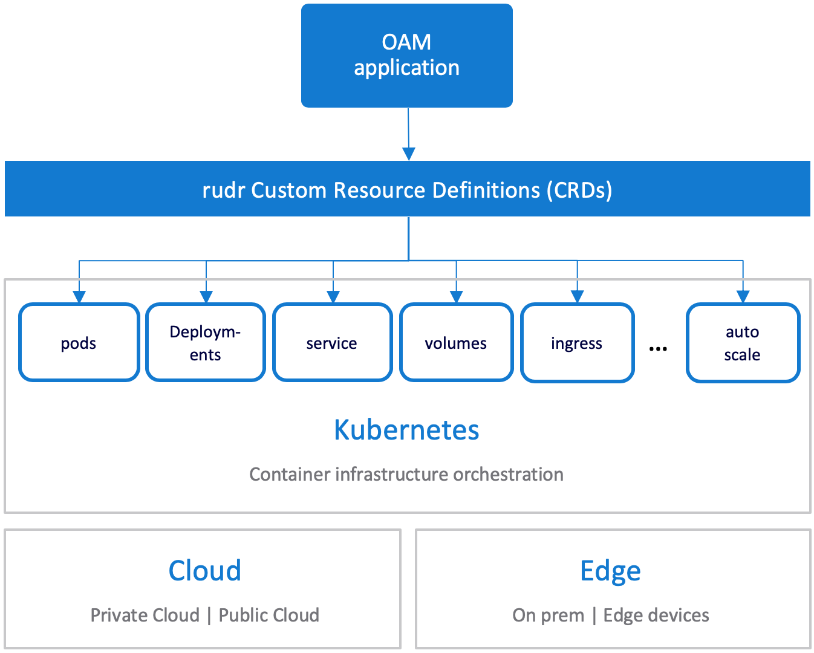

# Rudr: A Kubernetes Implementation of the Open Application Model

Rudr is an implementation of the [Open Application Model (OAM)](https://github.com/oam-dev/spec) that allow users to deploy and manage applications easily on any Kubernetes cluster with separation of concerns of application developer and operator.

**Rudr is currently in alpha. It may reflect the API or features we are vetting before inclusion into the Open App Model spec..**

## How to: Create an app from scratch

Get started with a [How-To](./docs/how-to/create_component_from_scratch.md) guide.

## We believe creating cloud native applications should not be hard

Users want to focus on describing and building applications easily but achieving this directly with Kubernetes is complex. At the heart of it, container orchestration platform inextricably mixed together application primitives with infrastructure primitives. Different roles like developers and operators have to concern with problems from domains of each other and adjust themselves to understand the whole picture of the underlying infrastructure.

The requirement to deep understand the container infrastructure has introduced the following problems for application deployment and management:

- There is no standard definition for a cloud native application which makes it difficult for users looking for an easier way to modernize.
- There are myriad of tools and ways to accomplish tasks. On one hand, this is positive because it gives users the freedom to choose their own path. However, for users looking for an opinionated way to do things, there is an opportunity.
- It is difficult to have a clear separation of roles between infra operators, app operators and developers. Users are exposed to constructs out of their domain that they have to learn to accomplish day-to-day tasks.

## The approach: Let's take things one step at a time

Rudr takes an incremental approach to solving the problems. The current architecture is set of plugins for Kubernetes which allows OAM specifications to be implemented and deployed on Kubernetes clusters using native APIs (and you still use kubectl!).

- This allows app developers to focus on building OAM components, app operators to focus on operational capabilities through the OAM app config and infra operators to focus on Kubernetes.

- By leveraging the Open App Model, users now have a framework to define their apps on their Kubernetes clusters.

- Currently, Rudr will leverage the defined trait to accomplish the task. This gives the freedom to use whatever underlying tool the user wants while providing a trait that focuses on the functionality and not the technology. In the future, Rudr might provide a set of default technologies to provide the functionality desired by a trait.

## Try more things out yourself 

Read the [documentation list](./docs/README.md) for more options.

## Contributing

This project welcomes contributions and suggestions. See [CONTRIBUTING.md](CONTRIBUTING.md) for more details. Below are links to join the bi-weekly community meetings and our meeting notes. Community Slack channels & mailing lists will be added shortly (~ 10/1).

| Item        | Value  |
|---------------------|---|
| Mailing List | https://groups.google.com/forum/#!forum/oam-dev |
| Meeting Information | Bi-weekly (Starting Oct 23, 2019), Tuesdays 10:30AM PST  |
| Meeting Link | https://zoom.us/j/271516061  |
| IM Channel       | https://gitter.im/oam-dev/  |
| Meeting Notes       | https://docs.google.com/document/d/1nqdFEyULekyksFHtFvgvFAYE-0AMHKoS3RMnaKsarjs/edit?usp=sharing |
| Twitter      | [@oam_dev](https://twitter.com/oam_dev) |

## Governance

This project follows governance structure of numerous other open source projects. See [governance.md](governance.md) for more details.

## License

This project is available under the terms of the MIT license. See [LICENSE.txt](LICENSE.txt).
