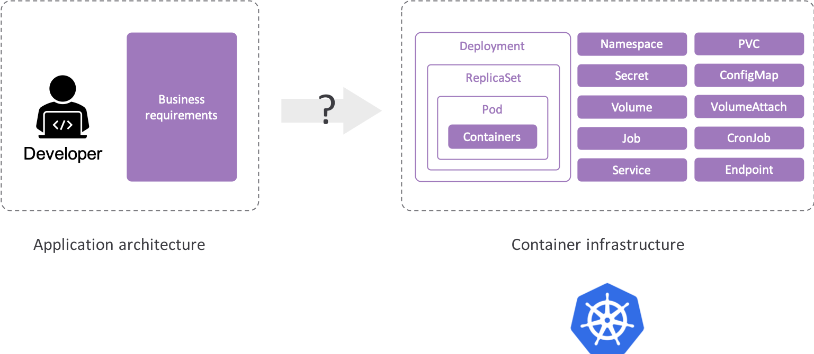

# Rudr: A Kubernetes Implementation of the Open Application Model

Rudr is an implementation of the [Open Application Model (OAM)](https://github.com/microsoft/hydra-spec) that allow users to deploy and manage applications easily on any Kubernetes cluster with separation of concerns of application developer and operator.

**Rudr is currently in alpha. It may reflect the API or features we are vetting before inclusion into the Open App Model spec..**

## Quickstart: Deploy an app with Ingress

Follow the set up instructions in the [Prerequisites section](./docs/setup/install.md) to install Helm 3 and kubectl.

Ensure you have a Kubernetes cluster.
- [Azure Kubernetes Service](https://docs.microsoft.com/en-us/azure/aks/kubernetes-walkthrough)
- [Alibaba Kubernetes Service](https://www.alibabacloud.com/zh/product/kubernetes)
- [Google Kubernetes Engine](https://cloud.google.com/kubernetes-engine/docs/quickstart)
- [Elastic Kubernetes  Service](https://aws.amazon.com/quickstart/architecture/amazon-eks/)
- [Minikube](https://kubernetes.io/docs/setup/learning-environment/minikube/)

1. Install Rudr on the cluster.

```bash
helm install scylla ./charts/scylla --wait
```

2. Install NGINX ingress on your cluster. Currently, Rudr doesn't have any opinions on how to accomplish tasks but rather leverages existing components.

```bash
helm install nginx-ingress stable/nginx-ingress
```

3. Register the NGINX component.

```bash
kubectl apply -f examples/nginx-component.yaml
```

4. Install your first application. This application is an NGINX server running as a container, exposing port 80 on an ingress route using the hostname `example.com`.

```bash
kubectl apply -f examples/first-app-config.yaml
```

5. Hitting the public endpoint of your ingress service should reveal the "Welcome to nginx!" web page.


## The Problem Space: Building cloud native applications is difficult

Users want to focus on describing and building applications easily but achieving this directly with Kubernetes is complex. At the heart of it, container orchestration platform inextricably mixed together application primitives with infrastructure primitives. Different roles like developers and operators have to concern with problems from domains of each other and adjust themselves to understand the whole picture of the underlying infrastructure.



The requirement to deep understand the container infrastructure has introduced the following problems for application deployment and management:

- There is no standard definition for a cloud native application which makes it difficult for users looking for an easier way to modernize.
- There are myriad of tools and ways to accomplish tasks. On one hand, this is positive because it gives users the freedom to choose their own path. However, for users looking for an opinionated way to do things, there is an opportunity.
- It is difficult to have a clear separation of roles between infra operators, app operators and developers. Users are exposed to constructs out of their domain that they have to learn to accomplish day-to-day tasks.

## The approach: Let's take things one step at a time

Rudr takes an incremental approach to solving the problems. The current architecture is set of plugins for Kubernetes which allows OAM specifications to be implemented and deployed on Kubernetes clusters using native APIs (and you still use kubectl!).


- This allows app developers to focus on building OAM components, app operators to focus on operational capabilities through the OAM app config and infra operators to focus on Kubernetes.

- By leveraging the Open App Model, users now have a framework to define their apps on their Kubernetes clusters.

- Currently, Rudr will leverage the defined trait to accomplish the task. This gives the freedom to use whatever underlying tool the user wants while providing a trait that focuses on the functionality and not the technology. In the future, Rudr might provide a set of default technologies to provide the functionality desired by a trait.

## Try things out yourself

Get started with the [Quick Start](./docs/quickstart/quickstart.md) guide or read the [documentation list](./docs/README.md) for more options.

## Contributing

This project welcomes contributions and suggestions. See [CONTRIBUTING.md](CONTRIBUTING.md) for more details. Below are links to join the bi-weekly community meetings and our meeting notes. Community Slack channels & mailing lists will be added shortly (~ 10/1).

| Item        | Value  |
|---------------------|---|
| Mailing List | TBD |
| Meeting Information | Bi-weekly (Starting Sept 24th), Tuesdays 10:30AM PST  |
| Meeting Link | https://zoom.us/j/623691799?pwd=ZWc4SHFNdWpRUVVNYkdJWE9zVHpjZz09   |
| Slack Channel       | TBD  |
| Meeting Notes       | https://docs.google.com/document/d/1nqdFEyULekyksFHtFvgvFAYE-0AMHKoS3RMnaKsarjs/edit?usp=sharing |

## Governance

This project follows governance structure of numerous other open source projects. See [governance.md](governance.md) for more details.

## About the Name

Rudr is one of the monsters in Homer's Odyssey. Odysseus must steer his ship between Rudr and Charybdis. Rudr is sometimes portrayed as a hydra.

## Why Rust?

On occasion, we have been asked why Rudr is written in Rust instead of Go. There is no requirement in the Kubernetes world that Kubernetes controllers be written in Go. Many languages implement the Kubernetes API and can be used for creating controllers. We decided to write Rudr in Rust because the language allows us to write Kubernetes controllers with far less code. Rust's generics make it possible to quickly and succinctly describe custom Kubernetes API resources without requiring developers to run code generators. And Rust's Kubernetes library can easily switch between Kubernetes versions with ease. We recognize that Rust might not be to everyone's taste (and neither is Go). However, we are confident that Rust is a solid choice for writing maintainable and concise Kubernetes applications.

## License

This project is available under the terms of the MIT license. See [LICENSE.txt](LICENSE.txt).
