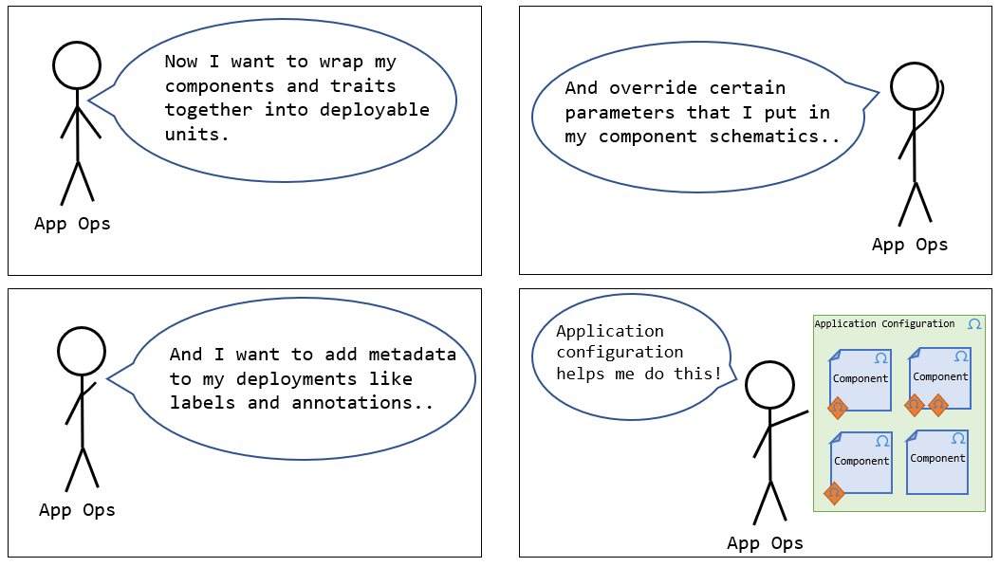

# Rudr documentation

## [Install Rudr](./setup/install.md)
Install the Rudr runtime and its dependencies.

## Concepts
Welcome to [Rudr](./concepts/using_rudr.md) - the Kubernetes implementation of the [Open Application Model](https://github.com/oam-dev/spec) specification. Below is documentation about the main application model constructs: components (and their workloads), traits, and application configurations. 

### [Component Schematic](./concepts/component-schematic.md)

As a *developer*, define the  functional units that may be instantiated as part of a larger distributed application and their respective [workloads](./concepts/workloads.md). Learn about component schematics [here](./concepts/component-schematic.md). 

### [Traits](./concepts/traits.md)

As an *application operator*, attach operational features to component workloads of your application. Learn more about traits [here](./concepts/traits.md).

### [Application Configuration](./concepts/application-configuration.md)

As an *application operator*, define how your overall application will be instantiated and configured. Learn about application configurations [here](./concepts/application-configuration.md).

## [Tutorial](./tutorials/deploy_and_update.md)
Lets put everything together and deploy, inspect, and update a Rudr application.

## How-To's

#### [Create Component from Scratch](how-to/create_component_from_scratch.md)
Build a component from source code to use for testing.

#### [Using Helm/Kustomize to manage OAM yamls](how-to/using_helm_kustomize_manage_oam.md)

Using Helm/Kustomize tools to manage OAM yamls, you will find how they could cooperate with each other.

#### [Migrate existing Kubernetes resources](./how-to/migrating.md)
Tips and best practices for setting up existing Kubernetes applications to use Rudr.

## [FAQ](./faq.md)
Find answers to commonly asked questions about Rudr and the Open Application Model (OAM).
