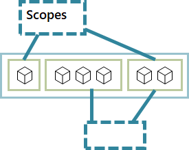

# Rudr documentation

*Rudr* is the Kubernetes reference implementation of the [Open Application Model](https://github.com/oam-dev/spec) (OAM) specification, a team-centric standard for building cloud-native apps, where:

<table border=0 rules=none>
<tr>
<td></td>
<td><b>Developers</b> define application <b>components</b>,</td>
</tr>
<tr>
<td></td>
<td><b>Application operators</b> create instances of those components, assign them to <b>application configurations</b>, and designate their operational capabilities, and,</td>
</tr>
<tr>
<td></td>
<td><b>Infrastructure operators</b> declare, install, and maintain the <b>underlying services</b> available on the platform.</td>
</tr>
</table>

To get started, check out the *Install Rudr* guide and the *Tutorial*. The *Concepts* guides will walk you through all the available options Rudr provides to run and manage applications, and the *How-Tos* cover more advanced scenarios.

## Get started

### [Install Rudr](./setup/install.md)
Install the Rudr runtime and its dependencies.

### [Tutorial](./tutorials/deploy_and_update.md)
Learn how to deploy, inspect, and update a Rudr application.

## Concepts
Learn more about the main application model constructs: components (and their workloads), traits, and application configurations.

### [Component Schematic](./concepts/component-schematic.md)

Learn how a <b>developer</b> can define the functional units that may be instantiated as part of a larger distributed application and their respective [**workloads**](./concepts/workloads.md).

 

### [Application Configuration](./concepts/application-configuration.md)

Learn how an <b>application operator</b> can define how an overall application will be instantiated and configured.

 

### [Traits](./concepts/traits.md)

Learn how an <b>application operator</b> can attach operational features to component workloads of an application.

 
 
 

### [Scopes](./concepts/scopes.md)

Learn how an <b>application operator</b> can define application boundaries by grouping components with common properties and dependencies.

## [Admission Controller](https://github.com/oam-dev/admission-controller)

Admission controller is used for mutating and validating OAM component, trait and application configuration spec.

## How-To's

### [Create a component from scratch](how-to/create_component_from_scratch.md)

Build a component from source code to use for testing.

### [Manage OAM files with Helm/Kustomize](how-to/using_helm_kustomize_manage_oam.md)

Learn how to use Helm/Kustomize tools to manage your OAM .yaml filese.

### [Migrate existing Kubernetes resources](./how-to/migrating.md)

Here are tips and best practices for migrating exsiting Kubernetes applications to use Rudr.

## Develop

#### [Writing a Trait](./developer/writing_a_trait.md)

Here's a walkthrough of the process for writing a new trait for Rudr.

#### [Debug](./developer/debug.md)

These are some useful tips for troubleshooting your Rudr deployments.

## [FAQ](./faq.md)

Find answers to commonly asked questions about Rudr and the Open Application Model (OAM).
