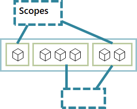
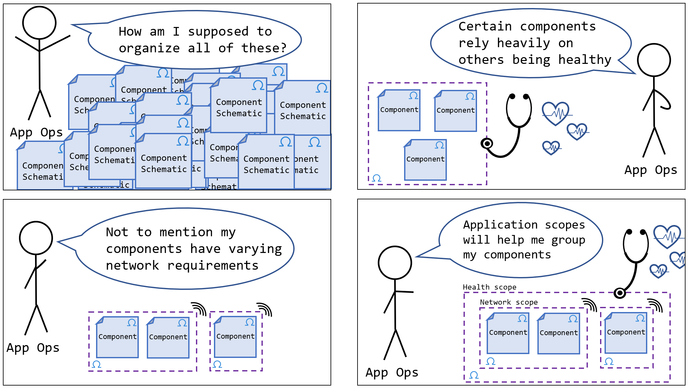

# Scopes



Application [*scopes*](https://github.com/oam-dev/spec/blob/master/4.application_scopes.md) are used to logically group components together by providing application boundaries that represent common group behaviors and/or dependencies. Scopes are not mutually exclusive: a given component can belong to multiple application scope instances at the same time. Once installed to your Rudr runtime, a scope can be used (and reused) across any number of [application configurations](./application-configuration.md). In terms of implementation details, scopes are Rudr-defined Kubernetes CRDs.

*Scopes* are assigned to component workloads by an [application operator](https://github.com/oam-dev/spec/blob/master/2.overview_and_terminology.md#roles-and-responsibilities).



Currently, Rudr supports the following scope types:

- [Health](#health-scope)

An [application operator](https://github.com/oam-dev/spec/blob/master/2.overview_and_terminology.md#roles-and-responsibilities) configures and assigns  scope instances to component workloads of an application in the [ApplicationConfiguration](application-configuration.md) file. For example, here's a custom configuration of the Rudr [health](#health) scope type:

<pre>
apiVersion: core.oam.dev/v1alpha1
kind: ApplicationConfiguration
metadata:
  <b style="color:blue;">name: my-health-scope</b>
spec:
  <b style="color:blue;">scopes:</b>
    - name: health
      type: core.oam.dev/v1alpha1.HealthScope
      properties:
        - name: probe-method
          value: "kube-get"
        - name: probe-endpoint
          value: ".status"
        - name: probe-timeout
          value: 30
        - name: probe-interval
          value: 60
        - name: failure-rate-threshold
          value: 0
        - name: healthy-rate-threshold
          value: 100.0
        - name: healthThresholdPercentage
          value: 100.0
</pre>

And here's how a component would be added to that scope within the [application configuration](application-configuration.md) file:

<pre>
apiVersion: core.oam.dev/v1alpha1
kind: ApplicationConfiguration
metadata:
  name: first-app
spec:
  components:
    - name: helloworld-python-v1
      instanceName: first-app-helloworld-python-v1
      parameterValues:
        - name: target
          value: Rudr
        - name: port
          value: "9999"
      traits:
        - name: ingress.core.oam.dev/v1alpha1
        properties:
          hostname: example.com
          path: /
          servicePort: 9999
      <b style="color: blue">applicationScopes:</b>
        - my-health-scope
</pre>

For more on using specific scopes, refer to the sections below.

## Supported scopes

Here's how to get info on the scopes supported on your Rudr installation.

**List supported scope types**:

```console
$ kubectl get scopes
```

**Show the schema details of a scope instance:**

```console
$ kubectl get <scope-type> <scope-name> -o yaml
````

... where `<scope-type>` is one of the Rudr-supported scopes types (per `kubectl get scopes`), and `<scope-name>` is the *name* of a particular scope configuration instance. For example: `kubectl get health my-health-scope -o yaml`.

## Health scope

You can use the *HealthScope* controller to periodically check the aggregate health of components within your application. For a full walkthrough, see [Health Scope Controller](../../healthscope/README.md)

### Installation

Use [Helm 3](https://v3.helm.sh/) to install the Rudr *HealthScope*:

```cmd
helm install healthscope ./charts/healthscope
```

### Properties

| Name | Description | Allowable values | Required | Default |
| :-- | :--| :-- | :-- | :-- |
| **probe-method** | The method to probe the components, e.g. 'httpGet'. | string | &#9745; | |
| **probe-endpoint** | The endpoint to probe from the components, e.g. '/v1/health'. | string | &#9745; | |
| **probe-timeout** | The amount of time in seconds to wait when receiving a response before marked failure. | int | | |
| **probe-interval** | The amount of time in seconds between probing tries. | int |||
| **failure-rate-threshold** | If the rate of failure of total probe results is above this threshold, declared 'failed'. | double |||
| **healthy-rate-threshold** | If the rate of healthy of total probe results is above this threshold, declared 'healthy'. | double |||
| **healthThresholdPercentage** | The % of healthy components required to upgrade scope. | double |||
| **requiredHealthyComponents** | Comma-separated list of names of the components required to be healthy for the scope to be health. | string |||

[Here's an example](../../examples/health-scope-config.yaml) of a health scope configuration. Once installed (`kubectl apply -f <health-scope-config>.yaml`) you would attach this to a component within the application configuration, similar to this [example](../../examples/first-app-config.yaml):

```yaml
# Example component scope assignment
apiVersion: core.oam.dev/v1alpha1
kind: ApplicationConfiguration
metadata:
  name: first-app
spec:
  components:
    - name: helloworld-python-v1
      instanceName: first-app-helloworld-python-v1
      parameterValues:
        # ...
      traits:
        # ...  
      applicationScopes:
        - my-health-scope
```

Once you deploy that application configuration, you can verify the health scope instance was created:

```console
kubectl get health
```

And get further details about it with `kubectl get health` **`my-health-scope`** `-o yaml`.
