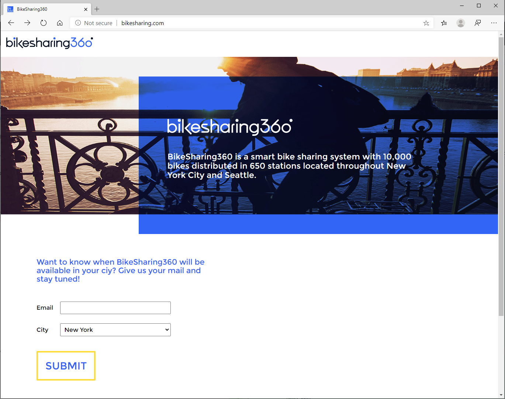

# BikeSharing360

[BikeSharing360 for multiple containers](https://github.com/microsoft/BikeSharing360_MultiContainer) adapted for Rudr.

BikeSharing360 is a fictitious example of a smart bike sharing system with 10,000 bikes distributed in 650 stations located throughout New York City and Seattle. Their vision is to provide a modern and personalized experience to riders and to run their business with intelligence.

BikeSharing 360 for single containers can be found [here](../BikeSharing360_SC).

# Building the project

Make sure that the ingress controller has been installed (instructions [here](../../docs/setup/install.md)).

Add the components:

```
> kubectl apply -f BikeSharing.Campaign/Manifest/bikesharing-ui-component.yaml
> kubectl apply -f Email.Api/Manifest/bikesharing-email-api-component.yaml
> kubectl apply -f Feedback.Api/Manifest/bikesharing-feedback-api-component.yaml
> kubectl apply -f Profile.Api/Manifest/bikesharing-profile-api-component.yaml
```

Validate that the components were created successfully:

```
> kubectl get components

NAME                          AGE
bikesharing-email-api-v1      11s
bikesharing-feedback-api-v1   7s
bikesharing-profile-api-v1    3s
bikesharing-ui-v1             16s
```

Apply the configuration:

```
> kubectl apply -f ApplicationConfiguration/bikesharing-app-configuration.yaml
```

Validate that the configuration was applied successfully:

```
> kubectl get configurations

NAME              AGE
bikesharing-app   25s
```

Wait for ingress to be created:

```
> kubectl get ingress

NAME                                     HOSTS             ADDRESS   PORTS   AGE
bikesharing-email-api-trait-ingress      bikesharing.com             80      2s
bikesharing-feedback-api-trait-ingress   bikesharing.com             80      2s
bikesharing-profile-api-trait-ingress    bikesharing.com             80      1s
bikesharing-ui-trait-ingress             bikesharing.com             80      2s
```

Navigating to bikesharing.com after mapping it to the correct IP address (found by `kubectl get services`) should take you to the home page.



## Blogs posts

Here's links relevant to this project:

- OAM project: [official website](https://oam.dev/)
- Open Source Blog: [OAM release announcement](https://cloudblogs.microsoft.com/opensource/2019/10/16/announcing-open-application-model/)

## Copyright and license
* Code and documentation copyright 2016 Microsoft Corp. Code released under the [MIT license](https://opensource.org/licenses/MIT).

## Code of Conduct 
This project has adopted the [Microsoft Open Source Code of Conduct](https://opensource.microsoft.com/codeofconduct/). For more information see the [Code of Conduct FAQ](https://opensource.microsoft.com/codeofconduct/faq/) or contact [opencode@microsoft.com](mailto:opencode@microsoft.com) with any additional questions or comments.
