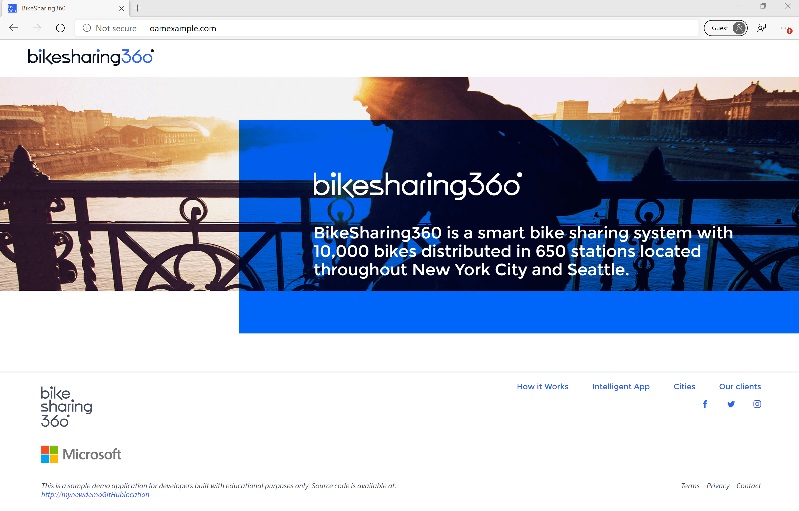

# BikeSharing360 with Rudr

[BikeSharing360 for single containers](https://github.com/microsoft/BikeSharing360_SingleContainer) adapted for Rudr.

BikeSharing360 is a fictitious example of a smart bike sharing system with 10,000 bikes distributed in 650 stations located throughout New York City and Seattle. Their vision is to provide a modern and personalized experience to riders and to run their business with intelligence.

BikeSharing 360 for multiple containers can be found [here](https://github.com/Microsoft/BikeSharing360_MultiContainer).

## Deploy and Inspect with Rudr

### Setting Up

For additional help with the Setting Up steps, see the official documentation for [Installing Rudr](https://github.com/oam-dev/rudr/blob/master/docs/setup/install.md) and/or [Rudr's 'Hello World' Guide](https://github.com/oam-dev/rudr/blob/master/docs/tutorials/deploy_and_update.md).

Begin by ensuring that you are working in the proper cluster, or switch to the desired context for deployment.
```
$ kubectl config current-context
my-cluster
```

Next, install rudr to the cluster using helm.
```
$ helm install rudr charts/rudr
NAME: rudr
LAST DEPLOYED: 2019-10-02 13:57:33.158655 -0600 MDT m=+5.183858344
NAMESPACE: default
STATUS: deployed
NOTES:
Rudr is a Kubernetes controller to manage Configuration CRDs.

It has been successfully installed.
```

Again using helm, install the nginx ingress controller trait to the cluster.
```
$ helm install nginx-ingress stable/nginx-ingress
NAME: nginx-ingress
LAST DEPLOYED: 2019-10-02 13:57:57.444655 -0600 MDT m=+2.129323603
NAMESPACE: default
STATUS: deployed
NOTES:
The nginx-ingress controller has been installed.
It may take a few minutes for the LoadBalancer IP to be available.
You can watch the status by running 'kubectl --namespace default get services -o wide -w nginx-ingress-controller'

...
```

### Deploy

First, apply the component schematics. In this case, we have a single component (the user interface).
```
$ kubectl apply -f Manifest/bikeshareing-sc-component.yaml
componentschematic.core.oam.dev/bikesharing-sc-component-v1 created
```

Next, apply the application configuration. 
```
$ kubectl apply -f Manifest/bikeshare-sc-config.yaml
applicationconfiguration.core.oam.dev/bikesharing-sc created
```

### Inspect

We can look at all applied component schematics to ensure proper deployment.
```
$ kubectl get componentschematics
NAME                          AGE
bikesharing-sc-component-v1   17s
```

Or we can view a single one in detail.
```
$ kubectl get componentschematic bikesharing-sc-component-v1 -o yaml
apiVersion: core.oam.dev/v1alpha1
kind: ComponentSchematic
metadata:
  ...
  generation: 1
  name: bikesharing-sc-component-v1
  namespace: default
  resourceVersion: "979906"
  selfLink: /apis/core.oam.dev/v1alpha1/namespaces/default/componentschematics/bikesharing-sc-component-v1
  uid: 80a6ab82-25b4-11ea-a462-7a73f2d3d989
spec:
  containers:
  - image: wdfox/bikesharing-sc:v1
    name: bikesharing-sc-container
    ports:
    - containerPort: 80
      name: http
      protocol: TCP
# ... more YAML
```

Additionally, we can see all deployed configurations.
```
$ kubectl get configurations
NAME             AGE
bikesharing-sc   19m
```

Or we can view a single configuration in detail.
```
$ kubectl get configuration bikesharing-sc -o yaml
apiVersion: core.oam.dev/v1alpha1
kind: ApplicationConfiguration
metadata:
  ...
  generation: 3
  name: bikesharing-sc
  namespace: default
  resourceVersion: "150038"
  selfLink: /apis/core.oam.dev/v1alpha1/namespaces/default/applicationconfigurations/bikesharing-sc
  uid: 2d831590-2353-11ea-847b-1ebd1089eac0
spec:
  components:
  - componentName: bikesharing-sc-component-v1
    instanceName: bikesharing-app-v1
    traits:
    - name: ingress
      parameterValues:
      - name: hostname
        value: oamexample.com
      - name: path
        value: /
      - name: service_port
        value: 9999
status:
  components:
    bikesharing-sc-component-v1:
      deployment/bikesharing-app-v1: running
      ingress/bikesharing-app-v1-trait-ingress: created
      service/bikesharing-app-v1: created
  phase: synced
```

### Viewing the Site

Navigating to oamexample.com after mapping it to the ingress controller's external IP address (found by `kubectl get services`) should take you to the home page.



## Blogs posts

Here's links relevant to this project:

- OAM project: [official website](https://oam.dev/)
- Open Source Blog: [OAM release announcement](https://cloudblogs.microsoft.com/opensource/2019/10/16/announcing-open-application-model/)

## Copyright and license
* Code and documentation copyright 2016 Microsoft Corp. Code released under the [MIT license](https://opensource.org/licenses/MIT).

## Code of Conduct 
This project has adopted the [Microsoft Open Source Code of Conduct](https://opensource.microsoft.com/codeofconduct/). For more information see the [Code of Conduct FAQ](https://opensource.microsoft.com/codeofconduct/faq/) or contact [opencode@microsoft.com](mailto:opencode@microsoft.com) with any additional questions or comments.
